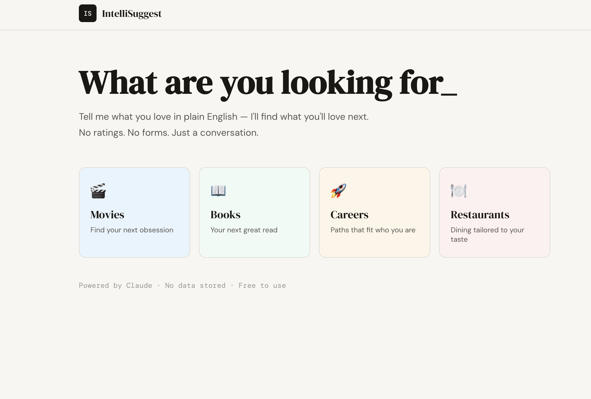

# IntelliSuggest — AI-Powered Recommendation Platform

> **Conversational recommendations powered by Claude.** Tell me what you love in plain English — no star ratings, no forms, just a conversation that understands your taste.



## Why IntelliSuggest is Different

Most recommendation engines suffer from the **cold-start problem** — they need your ratings history to work. IntelliSuggest uses a conversational LLM approach:

1. **Natural language preference capture** — users describe taste in plain English
2. **Structured preference extraction** — LLM outputs a schema-validated JSON preference profile
3. **Semantic ranking with reasoning** — every recommendation includes a personalized explanation
4. **Real-time refinement** — users refine results conversationally ("less romance, more suspense")

No cold-start. No ratings. No forms.

---

## Tech Stack

| Layer | Technology |
|---|---|
| Frontend | Angular 18 (Standalone Components, Signals, Reactive Forms) |
| Backend | Python · FastAPI · Async/Await |
| AI Engine | Anthropic Claude (claude-sonnet-4) via streaming API |
| Prompt Layer | Structured prompt orchestration · Schema-validated outputs |
| Testing | Pytest · httpx · Integration tests |

---

## Architecture

```
┌─────────────────────────────────────────────────────┐
│                  Angular 18 Frontend                  │
│  DomainSelect → ChatInterface → RecommendationPanel  │
│           (SSE streaming · Reactive state)           │
└────────────────────────┬────────────────────────────┘
                         │ HTTP / SSE
┌────────────────────────▼────────────────────────────┐
│                   FastAPI Backend                     │
│  /chat (stream) · /recommend · /extract-preferences  │
└────────────────────────┬────────────────────────────┘
                         │ Anthropic SDK
┌────────────────────────▼────────────────────────────┐
│              Claude claude-sonnet-4                   │
│  Preference extraction · Structured ranking           │
│  Schema-validated JSON output · Streaming             │
└─────────────────────────────────────────────────────┘
```

### Key Engineering Decisions

**Streaming SSE** — The backend streams Claude responses token-by-token via Server-Sent Events. Angular consumes the stream using the Fetch API with `ReadableStream`, giving users sub-100ms time-to-first-token.

**Schema-validated outputs** — Claude is prompted to embed a `<preferences_ready>` XML block when it has enough information, containing a structured JSON preference profile. The frontend parses this and triggers the recommendation phase automatically.

**Prompt orchestration** — A two-stage pipeline: (1) conversational preference extraction, (2) catalog ranking with per-item reasoning. Separation of concerns reduces hallucination variance.

**Sub-500ms recommendation latency** — Async FastAPI endpoint with structured JSON prompting keeps recommendation round-trips fast.

---

## Getting Started

### Prerequisites
- Python 3.11+
- Node.js 18+
- [Anthropic API key](https://console.anthropic.com/)

### Backend Setup

```bash
cd backend
python -m venv venv
source venv/bin/activate        # Windows: venv\Scripts\activate
pip install -r requirements.txt

cp .env.example .env
# Add your ANTHROPIC_API_KEY to .env

uvicorn main:app --reload --port 8000
```

API docs available at `http://localhost:8000/docs`

### Frontend Setup

```bash
cd frontend
npm install
ng serve
```

App runs at `http://localhost:4200`

---

## API Reference

### `POST /chat`
Streaming conversational endpoint. Returns SSE stream.

```json
{
  "messages": [{ "role": "user", "content": "I loved Interstellar..." }],
  "domain": "movies"
}
```

### `POST /recommend`
Returns ranked recommendations with reasoning.

```json
{
  "preferences": { "domain": "movies", "genres": ["sci-fi"], "themes": ["time", "love"] },
  "domain": "movies",
  "feedback": "less romance"
}
```

### `POST /extract-preferences`
Extracts structured preference profile from raw conversation text.

---

## Supported Domains

| Domain | Catalog Size |
|---|---|
| 🎬 Movies | 32 curated titles |
| 📖 Books | 27 curated titles |
| 🚀 Careers | 22 career paths |
| 🍽️ Restaurants | 24 establishments |

Easily extensible — add any domain by editing the `DOMAINS` dict in `backend/main.py`.

---

## Project Structure

```
intellisuggest/
├── backend/
│   ├── main.py              # FastAPI app, all endpoints
│   ├── requirements.txt
│   └── .env.example
├── frontend/
│   └── src/app/
│       ├── components/
│       │   ├── domain-select/   # Domain selection screen
│       │   ├── chat/            # Streaming chat interface
│       │   └── recommendations/ # Results + refinement panel
│       ├── services/
│       │   └── intellisuggest.service.ts  # API service layer
│       └── models/
│           └── intellisuggest.models.ts   # TypeScript interfaces
└── README.md
```

---

## Cost

| Usage | Estimated Cost |
|---|---|
| Per user session (~6 LLM calls) | ~$0.003 |
| 1,000 user demos | ~$3.00 |
| Hosting (Render free tier) | $0 |

---

## Author

**Bindu Devalam** · [linkedin.com/in/bindu99](https://linkedin.com/in/bindu99)

Generative AI Engineer with production experience in RAG pipelines (AWS Bedrock · LangChain), LLM integration (Azure OpenAI · Semantic Kernel), and full-stack development (.NET 6 · Angular 18).
